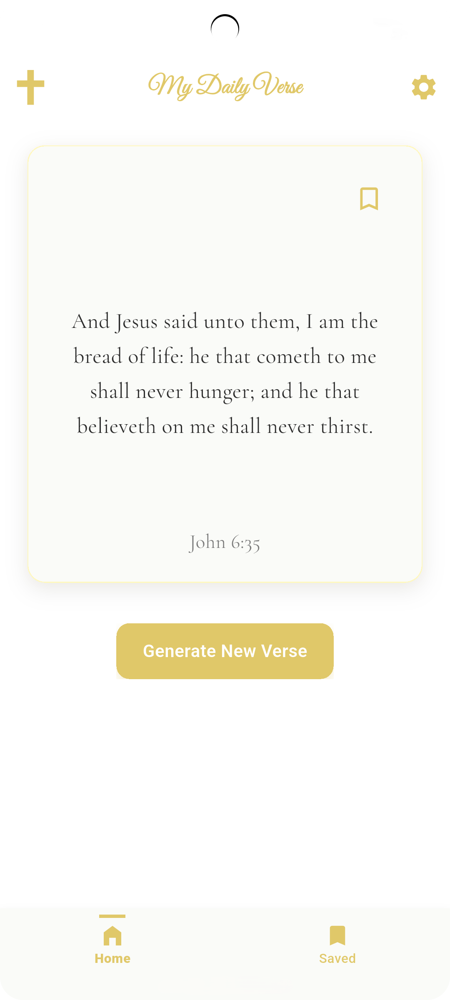
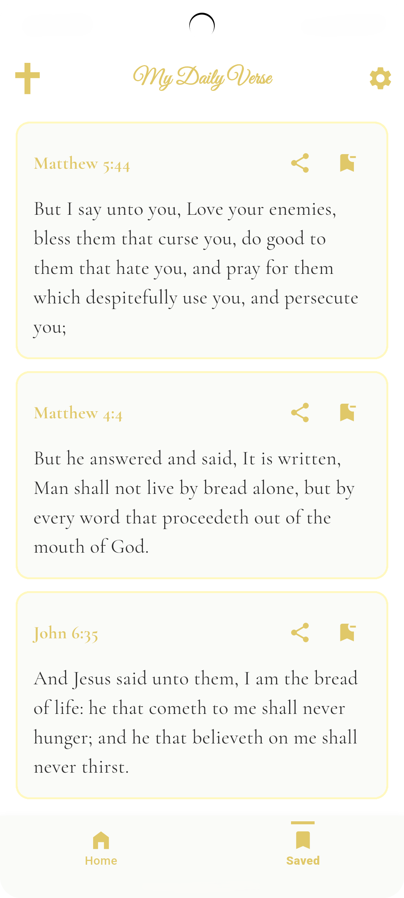

<h1 align="center">My Daily Verse</h1>

  A clean, minimal Bible verse app built with Flutter, delivering daily scripture, verse discovery, and personal collections.

  
  &nbsp;&nbsp;&nbsp;
  

---

## Features

- **Verse of the Day** — a new verse every day, automatically selected
- **Random Verse Generator** — discover scripture from 1,100+ verses
- **Save Verses** — bookmark verses to your personal collection
- **Share** — share any verse directly from your saved collection
- **Daily Reminders** — optional notification at a time you choose
- **Light / Dark / System Theme** — follows your device or your preference
- **Offline Support** — Bible verses stored locally, no internet required for core features

## Tech Stack

| Layer | Technology |
|---|---|
| Framework | Flutter + Dart |
| Authentication | Firebase Auth (Email + Google) |
| Database | Cloud Firestore |
| Verse Data | Local JSON (offline-first) |
| Notifications | flutter_local_notifications |

## Screens

| Screen | Description |
|---|---|
| Home | Verse of the Day with bookmark and generate button |
| Saved | Personal collection of bookmarked verses |
| Settings | Theme, reminder time, and account management |
| Auth | Email/password and Google Sign-In |
